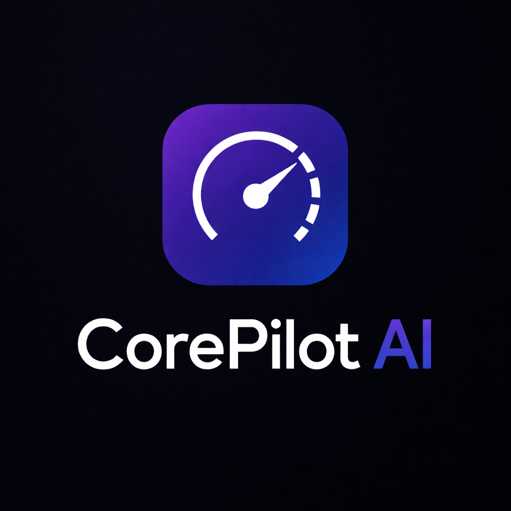
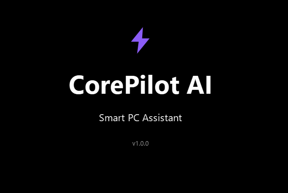
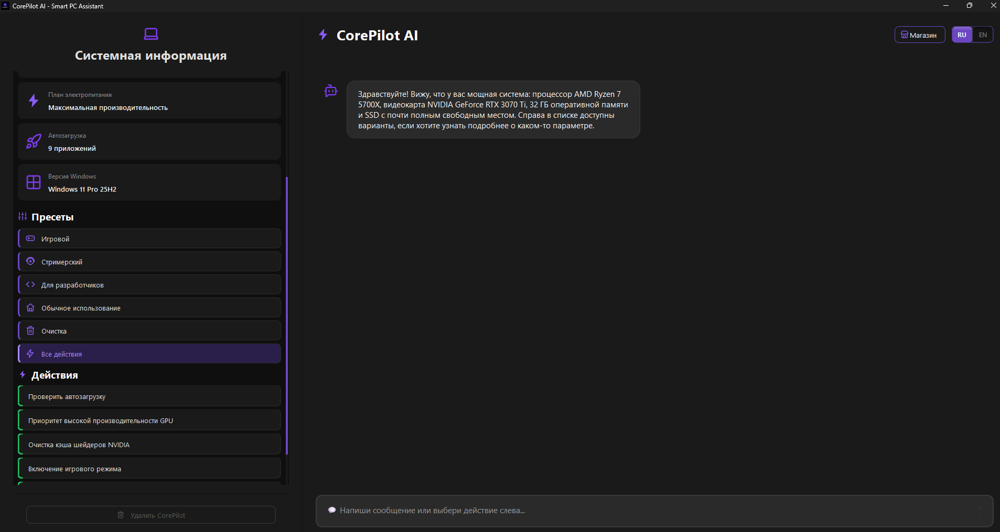
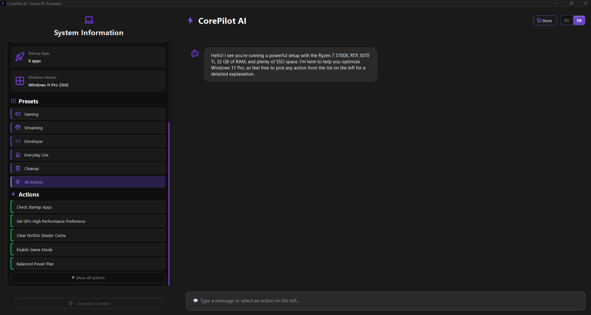
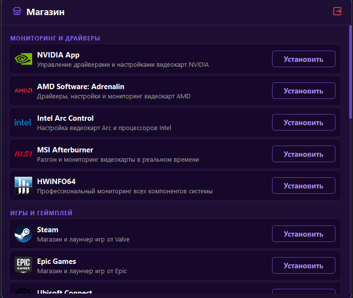
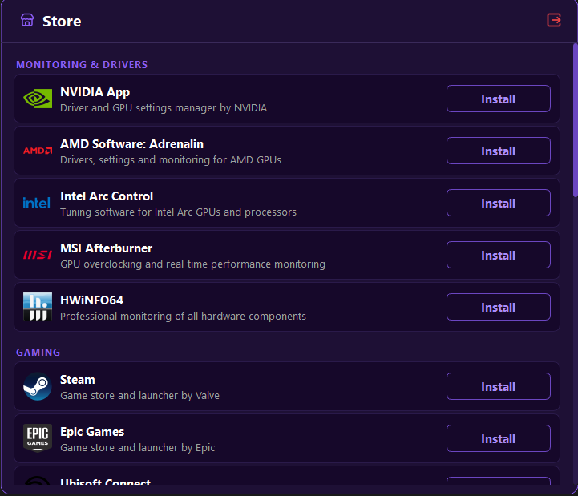

<!--
SEO: Windows optimizer, Windows 11 optimizer, PC optimization tool, boost FPS Windows, debloat Windows 10, gaming optimization tool, improve PC performance, local AI assistant, Ollama GUI, Qwen offline AI, PC cleaner alternative to CCleaner
-->

# 🛰️ CorePilot AI

<p align="center">


</p>


## 🚀 Ultimate Windows Optimization Tool with Local AI Assistant
Boost FPS • Clean Junk • Improve Performance • 100% Local & Private

---

## 📸 Preview








---

# 🇷🇺 Русская версия

## 🔥 Что такое CorePilot AI

**CorePilot AI** — это современный **оптимизатор Windows 10 / 11**, который сочетает:

- ⚙️ оптимизацию системы  
- 🧠 локальный AI (без интернета)  
- 🎮 повышение FPS  
- 🔒 полную приватность  

👉 Это не “волшебная кнопка”  
👉 Это инструмент контроля над системой  

---

## 🚀 Основные возможности

- 🧹 очистка мусора (temp, кэш, лишние файлы)
- ⚙️ управление автозагрузкой
- 🎮 оптимизация под игры (FPS boost)
- 🔋 снижение нагрузки и энергопотребления
- 📊 мониторинг системы (CPU, GPU, RAM, диск)
- 🧠 AI объясняет каждое действие
- 🔄 откаты (undo)

---

## 🛒 Встроенный магазин приложений

Внутри CorePilot есть удобный каталог:

- 🌐 браузеры
- 🎮 Steam / Epic Games
- 🎧 полезный софт
- 🧰 драйвера и утилиты

👉 всё в одном месте, без поиска в браузере

---

## 🧠 Как работает AI

- используется **Ollama + Qwen**
- работает локально (127.0.0.1)
- НЕ выполняет команды сам
- только объясняет

👉 решения принимает код  
👉 AI — помощник, а не исполнитель  

---

## 🔥 Почему CorePilot лучше CCleaner и аналогов

### ❌ Обычные оптимизаторы

- скрытые изменения  
- сомнительное “ускорение”  
- реклама и мусор  
- облачные зависимости  

### ✅ CorePilot AI

- прозрачные действия  
- полный контроль  
- локальный AI (без интернета)  
- безопасные твики  
- система откатов  

---

## 🎮 Для геймеров

- boost FPS  
- меньше лагов  
- отключение лишних процессов  

👉 идеально для онлайн игр и слабых ПК  

---

## 💻 Для разработчиков

- локальный AI без API  
- приватная среда  
- удобная архитектура  

---

## 🚀 Быстрый старт

1. Установить Ollama → https://ollama.com  
2. Скачать модель:
```
ollama pull qwen3.5:4b
```
3. Запустить:
```
python main.py
```

---

## ⚠️ Важно

- некоторые действия требуют админа  
- всё подтверждается пользователем  

---

# 🇺🇸 English Version

## 🚀 CorePilot AI

**Powerful Windows Optimization Tool with Local AI Assistant**

---

## 🔥 What is CorePilot

CorePilot AI is a modern:

- Windows optimizer  
- PC cleaner  
- FPS booster  
- Local AI assistant  

👉 Fully private  
👉 No cloud required  

---

## 🚀 Features

- PC cleanup (junk removal)
- Startup manager
- Gaming optimization (FPS boost)
- System monitor
- Local AI assistant
- App store inside app
- Undo system

---

## 🧠 Local AI

- Powered by Ollama  
- Uses Qwen model  
- Runs fully offline  
- No data leaks  

---

## 🛒 Built-in App Store

- Browsers  
- Steam / Epic Games  
- Drivers  
- Useful tools  

---

## 🎮 For Gamers

- boost FPS  
- reduce lag  
- optimize processes  

---

## 💻 For Developers

- local AI (no API)
- full control
- safe tweaks

---

## 🚀 Quick Start

```
ollama pull qwen3.5:4b
python main.py
```

---

## ⭐ Keywords

Windows optimizer, PC optimizer, boost FPS Windows, debloat Windows 10, improve PC performance, gaming optimization tool, local AI assistant, Ollama GUI, Qwen offline AI

---

## 👨‍💻 Author

https://github.com/Danil1ch

---

⭐ Star the repo if you like it!
